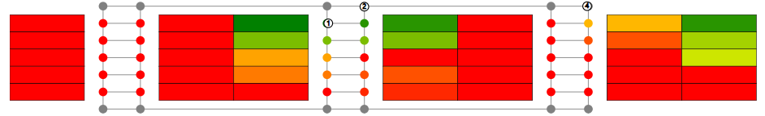

# Warehouse routing visualization tool



## About

This is a rewrite of a warehouse routing visualisation tool I built for my thesis. Notable technologies that are used are d3.js, vue and bootstrap. 

A warehouse is shown with an underlying graph. Each storage cell in the warehouse has a color that indicates how urgently it has to be scanned. The white circles that are moving in the graph represent drones that scan the storage cells. 


### Scan strategies 
* **Serial**: Scan the storage cells in warehouse column per column
* **Random**: Move to a random direction in the graph and scan the storage cell there

### Other notable features

* The simulation can essentially be viewed as a video. This means that it is possible to speedup the simulation speed, move to an arbitrary moment in the simulation, etc
* Custom configurations can easily be created with different warehouse dimensions, different durations etc.

## Getting started

### Requirements

* npm
* node

## Installation

1\. Install required dependencies
```
npm install
```

2\. Run application
```
npm start
```

3\. Go to localhost:8080 to see the application in action
